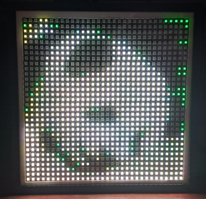

# spotify-album-art-matrix

[](LICENSE)

Stream album art from your Spotify account in near real-time to a 32 by 32 WS2812B LED matrix via an Arduino UNO R4 WiFi microcontroller board; whatever is playing on your account will show up on the display instantly.



Otherwise, [baby panda 🐼](https://baike.baidu.com/en/item/Giant%20panda%20Mei%20Zhu/32477) will be shown instead when no Spotify client is active or when playback is completely stopped.

## You Will Need

- [Spotify Developer Account with Spotify Premium access](https://developer.spotify.com)
- Python 3.14+ for obtaining Spotify API refresh token.
- Arduino UNO R4 WiFi with USB cable.
- Four pieces of 32 by 8 (or 16 by 16) WS2812B addressable LED matrix panel. Total size of combined panels should be 32 by 32 pixels.
- 3 jumper wires for connecting the combined LED matrix to the Arduino.
- _Optional:_ 470 Ω resistor to prevent voltage spikes from damaging the LED matrix.
- _Optional:_ Enclosure for the Arduino and LED matrix panel; IKEA SANNAHED 35x35 cm works well, the inner 24x24 cm mount opening can be enlarged with a pen knife to fit the LED matrix panel snugly.

## Setup

### Spotify API and WiFi Credentials

1. Install [Arduino IDE](https://www.arduino.cc/en/software) on your computer.

1. Clone this repository.

1. Copy `arduino_secrets_dev.h` to `arduino_secrets.h` and update your WiFi credentials in `arduino_secrets.h`.

    ```bash
    cp --update=none ~/spotify-album-art-matrix/arduino_secrets_dev.h ~/spotify-album-art-matrix/arduino_secrets.h
    ```

1. Sign in to your [Spotify Developer](https://developer.spotify.com) account (Spotify Premium is required).

1. [Create](https://developer.spotify.com/dashboard/create) a Spotify app.

1. Fill in the following details
    - **App name**: `Album Art Matrix`
    - **App description**: `Display Spotify album art on a WS2812B LED matrix.`
    - **Redirect URIs**: `http://127.0.0.1:3000/callback`
    - **APIs used**: Select `Web API`.

1. Agree with the Terms of Service and click "Save".

1. In the Spotify dashboard, select your newly created app and copy the `Client ID` and `Client secret` to the [spotify-album-art-matrix/arduino_secrets.h](./spotify-album-art-matrix/arduino_secrets.h) file under the fields `CLIENT_ID` and `CLIENT_SECRET`.

1. Run the following script to obtain the `REFRESH_TOKEN` for Spotify API access:

    ```bash
    python3 get_refresh_token.py
    ```

    Copy the refresh token from the output to the [spotify-album-art-matrix/arduino_secrets.h](./spotify-album-art-matrix/arduino_secrets.h) file under the field `REFRESH_TOKEN`.

### Hardware Setup

1. From Arduino IDE, install the following libraries:
    - [ArduinoHttpClient](https://github.com/arduino-libraries/ArduinoHttpClient) by Arduino
    - [Adafruit GFX Library](https://github.com/adafruit/Adafruit-GFX-Library) by Adafruit
    - [Adafruit NeoMatrix](https://github.com/adafruit/Adafruit_NeoMatrix) by Adafruit
    - [Adafruit NeoPixel](https://github.com/adafruit/Adafruit_NeoPixel) by Adafruit
    - [base64](https://github.com/Densaugeo/base64_arduino) by Densaugeo
    - [TJpg_Decoder](https://github.com/Bodmer/TJpg_Decoder) by Bodmer

1. Open and upload [spotify-album-art-matrix.ino](spotify-album-art-matrix/spotify-album-art-matrix.ino) to your Arduino UNO R4. Once uploaded, unplug the Arduino.

1. [Daisy-chain](<https://simple.wikipedia.org/wiki/Daisy_chain_(engineering)>) the 4 WS2812B LED matrix panels together (Data Out of the first panel to Data In of the second panel, and so on). Data Out of the last panel should not be connected to anything.

1. Depending on how you arrange the panels, and how your panels are manufactured, you may need to adjust the `static Adafruit_NeoMatrix matrix = Adafruit_NeoMatrix` variable configuration in [spotify-album-art-matrix.ino](spotify-album-art-matrix/spotify-album-art-matrix.ino) to ensure the pixels are mapped correctly.

> [!CAUTION]
> Ensure that the Arduino is unplugged when connecting the LED matrix panel to avoid any potential short circuits or damage to the components.

1. Connect the _main_ WS2812B LED matrix panel to the Arduino as follows:
    - LED matrix panel **GND** to Arduino **GND**
    - LED matrix panel **5V** to Arduino **5V**
    - LED matrix panel **Data In** (⚠️ not **Data Out**) to Arduino **Digital Pin 6** (with optional 470 Ω resistor in series)

1. Plug in the Arduino, and play a song on Spotify. The LED matrix panel should light up and start displaying the album art of the currently playing track.

## Sources

- [Adafruit NeoPixel Uberguide](https://learn.adafruit.com/adafruit-neopixel-uberguide)
- [Adafruit NeoMatrix Library](https://github.com/adafruit/Adafruit_NeoMatrix)

## Disclaimer

- This is not an official Spotify product or service.
